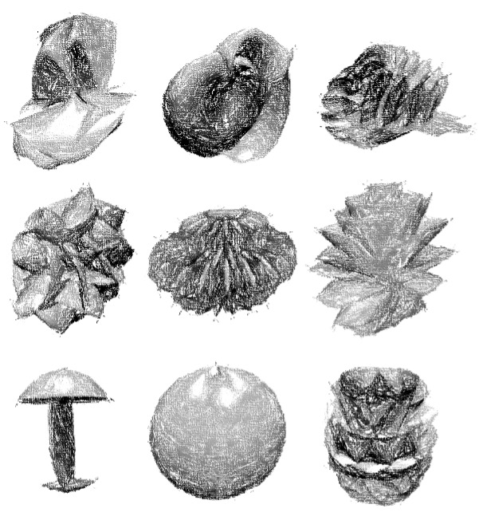

# Leonardo Generative Design Engine

**Daniel Hauser**
*Head of Data Engineering & Analytics, Bank für Tirol und Vorarlberg AG, Austria*
<span style="font-size:small;">
LinkedIn: https://www.linkedin.com/in/daniel-hauser-77259a159/
GitHub: **https://github.com/dugi42/**
</span>

## 0. Clone, install and run Leonardo

**Prerequists**
✅ Python 3.X installed
✅ GIT installed
✅ Hungry for awesome 

Clone the repo by executing the following code
```bash
git clone https://github.com/dugi42/leonardo.git
```

 You can create the anaconda environment needed for running the engine from the environment.yml file using the following command in your terminal:
```bash
conda env create -f environment.yml
```

To execute the engine use the following command 
```bash
python3 main.py -c config.yml
```

## 1. Motivation
Generative AI is soooooo hot right now! That is why I desiced to build a generative 3D design engine purely based on basic mathematics (BOOOORING!!!), 100% explainable using 34 parameter :). This is actually true, check out the config.yml file in the repo.

The motivation for this projects goes back to my time as a Tech Lead being part of a great team pioniering 3D-printing of glass. The image below shows some randomly generated 3D designs.


*Claude Elwood Shannon*, the father of information theory concluded that **information is surprise**. Only when we are surprised, we will learn something profound and important about the underlying dynamics and laws of nature! This is also applicable in the context of arts & design since these disciplines meet at the intersection of control and accident leading to surprise.

**So fasten your seatbelts ladies and gents, because you will see some freaky linear algebra combined with nasty functions all wrapped up in pure Python 🤓**

## 2. The Math behind Leonardo

This chapter will illuminate some light on the thoughts and concepts behind the design engine. I am not claiming that this approach is the most elegant one, but it does the job. Suggestions for improvements are warmly welcome :)!

### 2.0. Coordinate systems
Coordinate systems are the backbone of every transformation. 

#### 2.0.1. Cylindrical Coordinates

Cylindrical coordinates can be related to Cartesian coordinates using the following equations:

- $ x = r \cdot \cos(\varphi) $
- $ y = r \cdot \sin(\varphi) $
- $ z = z $

Where \( r \) is the distance from the origin in the xy-plane, \( \varphi \) is the angle from the positive x-axis, and \( z \) is the height above the xy-plane.

#### 2.0.2. Spherical Coordinates

Spherical coordinates can be related to Cartesian coordinates using the following equations:

- \( x = r \cdot \cos(\varphi) \cdot \sin(\theta) \)
- \( y = r \cdot \sin(\varphi) \cdot \sin(\theta) \)
- \( z = r \cdot \cos(\theta) \)

Where \( r \) is the distance from the origin, \( \varphi \) is the angle in the xy-plane, and \( \theta \) is the angle from the positive z-axis.

#### 2.0.3. Torus Coordinates

Torus coordinates are a bit more complex to relate to Cartesian coordinates due to the torus' curved geometry. They are given by:

- \( x = (R + r \cdot \cos(\theta)) \cdot \cos(\varphi) \)
- \( y = (R + r \cdot \cos(\theta)) \cdot \sin(\varphi) \)
- \( z = r \cdot \sin(\theta) \)

Where \( R \) is the major radius, \( r \) is the minor radius, \( \theta \) is the azimuthal angle, and \( \phi \) is the angle in the xy-plane.

These equations allow us to translate points between the cylindrical, spherical, and torus coordinate systems and the familiar Cartesian coordinate system.


### 2.1. Grid generation

*Coming soon!*

### 2.2. Twist, Turn & Shout

#### 2.2.1 Rotation about the x-axis

To rotate a point \( P(x, y, z) \) counterclockwise by an angle \( \theta \) about the x-axis, the rotation matrix is:

\[
R_x(\theta) = 
\begin{bmatrix}
    1 & 0 & 0 \\
    0 & \cos(\theta) & -\sin(\theta) \\
    0 & \sin(\theta) & \cos(\theta)
\end{bmatrix}
\]

The new coordinates \( P'(x', y', z') \) can be found by multiplying the rotation matrix by the original coordinates:

\[
\begin{bmatrix}
    x' \\
    y' \\
    z'
\end{bmatrix}=
R_x(\theta)
\begin{bmatrix}
    x \\
    y \\
    z
\end{bmatrix}
\]

#### 2.2.2. Rotation about the y-axis

To rotate a point \( P(x, y, z) \) counterclockwise by an angle \( \theta \) about the y-axis, the rotation matrix is:

\[
R_y(\theta) = 
\begin{bmatrix}
    \cos(\theta) & 0 & \sin(\theta) \\
    0 & 1 & 0 \\
    -\sin(\theta) & 0 & \cos(\theta)
\end{bmatrix}
\]

The new coordinates \( P'(x', y', z') \) can be found by multiplying the rotation matrix by the original coordinates:

\[
\begin{bmatrix}
    x' \\
    y' \\
    z'
\end{bmatrix}=
R_y(\theta)
\begin{bmatrix}
    x \\
    y \\
    z
\end{bmatrix}
\]

#### 2.2.3. Rotation about the z-axis

To rotate a point \( P(x, y, z) \) counterclockwise by an angle \( \theta \) about the z-axis, the rotation matrix is:

\[
R_z(\theta) = 
\begin{bmatrix}
    \cos(\theta) & -\sin(\theta) & 0 \\
    \sin(\theta) & \cos(\theta) & 0 \\
    0 & 0 & 1
\end{bmatrix}
\]

The new coordinates \( P'(x', y', z') \) can be found by multiplying the rotation matrix by the original coordinates:

\[
\begin{bmatrix}
    x' \\
    y' \\
    z'
\end{bmatrix}=
R_z(\theta)
\begin{bmatrix}
    x \\
    y \\
    z
\end{bmatrix}
\]


### 2.3. Adding modulation and texture

*Coming soon!*


## 3. 🌈 Somewhere, over the rainbow ...
 
*Coming soon!*


