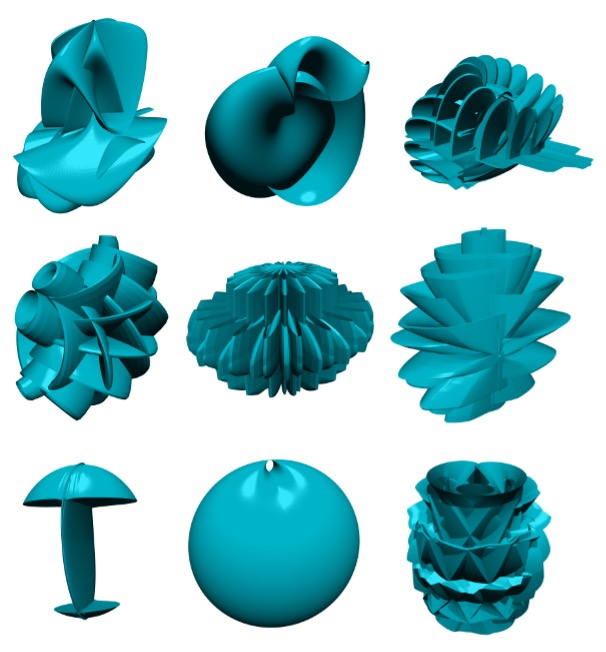

# Leonardo Generative Design Engine

Leonardo generates unique 3D objects from a small set of random parameters using
plain mathematics (no neural networks, 100% explainable). Every design is a
watertight mesh scaled to print size and exported as `.3mf` and `.stl`, ready to
drop into Bambu Studio (or any other slicer).



It runs as a small web app (preview + download) and as a command line tool, and
ships as a Docker image built for Raspberry Pi 4/5 (`linux/arm64`) and x86-64.

## Run on a Raspberry Pi with Docker

Requirements: Raspberry Pi 4 or 5 with the 64-bit Raspberry Pi OS and Docker
installed (`curl -fsSL https://get.docker.com | sh`).

```bash
git clone https://github.com/dugi42/leonardo.git
cd leonardo
docker compose up -d
```

Open `http://<pi-address>:8000`. Click **Design** for a new object, **Download
3MF** to get the print file. The seed shown under the buttons identifies the
design; the same seed always produces the same object.

`docker compose up` builds the image on the Pi the first time (a few minutes).
Pushes to `main` also publish a prebuilt multi-arch image to
`ghcr.io/dugi42/leonardo:latest`; `docker compose pull` fetches it instead of
building.

### Headless batch generation

```bash
# 5 designs, both formats, into ./output on the host
docker compose run --rm leonardo leonardo generate --count 5 --out /data

# reproducible: a fixed seed, one model, STL only
docker compose run --rm leonardo leonardo generate --seed 42 --model csym --format stl --out /data
```

Files are named `<seed>_<model>.stl` / `<seed>_<model>.3mf`.

## Print on a Bambu Lab printer

1. Open Bambu Studio, **File > Import > Import 3MF/STL/...** and pick the `.3mf`.
2. The object arrives in millimetres, standing on the bed, 100 mm tall and at
   most 180 mm wide (fits every Bambu bed including the A1 mini). Scale it if
   you want it bigger.
3. Slice and print. Meshes are closed and consistently oriented, so no repair
   step is needed. Organic shapes with overhangs print best with tree supports
   or at 0.2 mm layer height with "slow down for overhangs" enabled.

Print size and limits live in `config.yml` under `print:`.

## Command line

```
leonardo [--config config.yml] generate [--seed N] [--count K] [--model csym|rsym|random]
                                        [--out DIR] [--format stl,3mf] [--points N]
leonardo [--config config.yml] serve    [--host 0.0.0.0] [--port 8000]
```

Environment variables `LEONARDO_CONFIG` and `LEONARDO_OUT` set the defaults for
`--config` and `--out`. `generate` prints one `seed<TAB>model<TAB>path` line per
file and exits 1 if any seed was skipped because its mesh failed validation.

## Development

```bash
python3.12 -m venv .venv && . .venv/bin/activate
pip install -e '.[dev]'
pytest
ruff check .
leonardo serve --port 8050      # Dash dev server
```

`pytest` checks, among other things, that 50 seeds per model produce watertight,
consistently wound, positive-volume meshes within the configured print size.

Versioning follows [SemVer](https://semver.org): a change that alters the object
a seed produces is a major release.

### How it works

`leonardo/engine/`:

| module | role |
|---|---|
| `grid.py` | structured parametric grid; two triangles per quad, seams closed by index modulo, fan caps for open ends |
| `spline.py` | random B-spline modulators (scipy) |
| `texture.py` | sine / sawtooth / square / gausspulse-train surface textures; integer frequency on wrapped angles so seams close |
| `transforms.py` | twist, tilt, polar superellipse edges, fit-to-print scaling (pure functions) |
| `models.py` | `csym` (cylindrical) and `rsym` (ellipsoid / torus) base models |
| `params.py` | samples a parameter set from the ranges in `config.yml` |
| `mesh.py` | `generate(config, seed, model)` -> `Design`; watertight check; STL/3MF export via trimesh |

All randomness flows through one `numpy.random.Generator` seeded per design, so
a seed fully identifies an object. The web preview uses a coarser grid
(`app.preview_points`) than the export (`models.*.num_points`); both come from
the same seed and parameters.

A seed identifies an object only for a given major version: any change to the
geometry maths changes what a seed produces, and is released as a new major
version (see `CHANGELOG.md`).

### Geometry guarantees

Both models are built so that the mesh cannot fold or cross itself:

- `csym`: every cross-section is star-shaped around the axis. The radius is a
  positive function of `(z, phi)`, the superellipse uses its polar form (the
  point stays on the ray at angle `phi`), and twist and tilt act per z-slice.
- `rsym` ellipsoid: a single positive scale factor per vertex (theta texture
  times phi texture) scales the position vector, so the surface stays
  star-shaped around the origin. The phi texture fades to zero at the poles.
- `rsym` torus: the same factor scales the tube radius and is capped below the
  ring radius, so the tube never crosses itself.
- Textures on wrapped angles (`phi`, torus `theta`) round their frequency to an
  integer, so the wave closes on itself and the seam at `phi = 0` is invisible.

`tests/test_models.py` checks, for 50 seeds per model, that meshes are
watertight, consistently wound, positive-volume, a valid volume (`rsym`), scaled
to the print size, and that the csym seam edge is no longer than any neighbouring
edge.

## License

GPL-3.0, see `LICENSE`.
