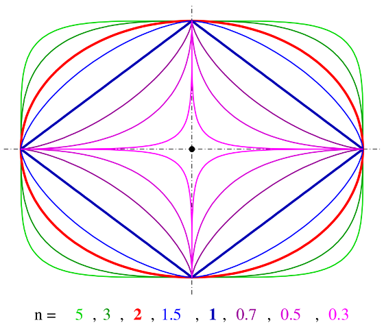

# Leonardo Generative Design Engine

**Daniel Hauser**
*Head of Data Engineering & Analytics, Bank für Tirol und Vorarlberg AG, Austria*
<span style="font-size:small;">
LinkedIn: https://www.linkedin.com/in/daniel-hauser-77259a159/
GitHub: **https://github.com/dugi42/**
</span>

## 0. Clone, install and run Leonardo on local host

**Prerequists**
✅ Python 3.X installed (using Anaconda or Miniconda is recommended)
✅ GIT installed
✅ Hungry for awesome 

Clone the repo by executing the following code
```bash
git clone https://github.com/dugi42/leonardo.git
```

 You can create the anaconda environment needed for running the engine from the environment.yml file using the following command in your terminal:
```bash
conda env create -f environment.yml
```

To execute the engine use the following command 
```bash
python3 main.py -c config.yml
```

## 1. Motivation
Generative AI is soooooo hot right now! That is why I desiced to build a generative 3D design engine purely based on basic mathematics (BOOOORING!!!), 100% explainable using 34 parameter :). This is actually true, check out the `config.yml` file in the repo.

The motivation for this projects goes back to my time as a Tech Lead being part of a great team pioniering 3D-printing of glass. We needed to generated different 3D-objects to explore and probe the high-dimensional parameter space of our manifacturing process. To overcome the timedemanding and manual 3D-design process I developed an infancy design tool which was purly based on cylinder symetric 3D-designs. Years later and as a side project I have to descided to restart this project and generalized the design capabilities by introducting rotational symetric design elements. The image below shows nine randomly generated 3D designs.

<div style="background-color: white; padding: 10px;">
  
</div>

*Claude Elwood Shannon*, the father of information theory concluded that **information is surprise**. Only when we are surprised, we will learn something profound and important about the underlying dynamics and laws of nature! This is also applicable in the context of arts & design since these disciplines meet at the intersection of control and accident leading to surprise.

**So fasten your seatbelts ladies and gents, because you will see some freaky linear algebra combined with nasty functions all wrapped up in pure Python 🤓**

## 2. The math behind the Leonardo Engine

This chapter will illuminate some light on the thoughts and concepts behind the engine. I am not claiming that this approach is the most elegant one, but it does the job. Suggestions for improvements are warmly welcome! All details can be found in the doc-strings and comments within `engine.py` module.

### 2.0. Coordinate systems
The engine is based on three different coordinate systems: cylindrical, spherical, and torus coordinates. The subchapters below are quickly reviewing the basics of these coordinate systems.

#### 2.0.1. Cylindrical Coordinates

Cylindrical coordinates can be related to Cartesian coordinates using the following equations:

$$
x = r \cdot \cos(\varphi)\\
y = r \cdot \sin(\varphi)\\
z = z 
$$


Where $r$ is the distance from the origin in the xy-plane, $\varphi$ is the angle from the positive x-axis, and $z$ is the height above the xy-plane.

#### 2.0.2. Spherical Coordinates

Spherical coordinates can be related to Cartesian coordinates using the following equations:

$$
x = r \cdot \cos(\varphi) \cdot \sin(\theta)\\
y = r \cdot \sin(\varphi) \cdot \sin(\theta)\\
z = r \cdot \cos(\theta)
$$

Where \( r \) is the distance from the origin, \( \varphi \) is the angle in the xy-plane, and \( \theta \) is the angle from the positive z-axis.

#### 2.0.3. Torus Coordinates

Torus coordinates are a bit more complex to relate to Cartesian coordinates due to the torus' curved geometry. They are given by:

$$
x = (R + r \cdot \cos(\theta)) \cdot \cos(\varphi)\\
y = (R + r \cdot \cos(\theta)) \cdot \sin(\varphi)\\
z = r \cdot \sin(\theta)
$$

Where \( R \) is the major radius, \( r \) is the minor radius, \( \theta \) is the azimuthal angle, and \( \phi \) is the angle in the xy-plane.

These equations allow us to translate points between the cylindrical, spherical, and torus coordinate systems and the familiar Cartesian coordinate system.


### 2.1. Grid generation

To generate a grid of points, we need to define the number of points in each dimension. Thus we will choose a 2D-grid which in the case of spherical coordinates will consist of two angles $(\varphi, \theta) \in [0, 2\pi[ \times [0, \pi]$. The grid is generated by the `generate_grid()` function in the `engine.py` module.
The grid is generated by the following code snippet:

```python
a, b = np.meshgrid(a, b)  # Generate meshgrid from linespaces
a, b = a.flatten(), b.flatten()  # Flatten to array
triangles = mtri.Triangulation(a, b)  # Create triangles
```

The `a` and `b` variables are the linespaces for the angles $\varphi$ and $\theta$ respectively. 
Once the grid is passed into the formulas for the described coordinate systems, $(x, y, z)$ coordiantes can be calculated for each point in the grid along with the corresponding triangulation. It's important to notice, that

The `triangles` variable is a `matplotlib.tri.Triangulation` object which is used to generate the 3D mesh. It's possible to pass the `triangles` object alongside the corresponding $(x,y,z)$ coordinates e.g. to the `plot_trisurf()` function of the `matplotlib` module to generate the 3D mesh or in this case to pass the `triangles` object to the `plotly` `graph_objs.Mesh3d` object to generate the 3D mesh. Using `plotly` for 3D visualization is a bit more convenient since it allows to interact with the 3D mesh and to rotate it in the browser. It also requires extraction of the vertix indicesfrom the `triangles` object. This is done by `get_ijk()` function in the `engine.py` module.


### 2.2. Transformations: Twist, Tilt & Edginess
Twisting and tilting are essential transformations for generating interesting 3D designs. The following subchapters will explain the math behind these transformations.

#### 2.2.1. Twist Transformation

To rotate a point $P(x, y, z)$ counterclockwise by an angle \( \alpha \) about the z-axis, the rotation matrix is:

$$
R_z(\alpha) = 
\begin{bmatrix}
    \cos(\alpha) & -\sin(\alpha) & 0\\
    \sin(\alpha) & \cos(\alpha) & 0\\
    0 & 0 & 1
\end{bmatrix}
$$

The new coordinates $P'(x', y', z')$ can be found by multiplying the rotation matrix by the original coordinates:

$$
\begin{bmatrix}
    x' \\
    y' \\
    z'
\end{bmatrix}=
R_z(\theta)
\begin{bmatrix}
    x \\
    y \\
    z
\end{bmatrix}
$$

To rotate all (x,y) coordinates generated from the 2D-grid by an angle \( \alpha \) about the z-axis, the function `generate_twist()` from the `engine.py` module is used. 

To create an alternation (back- & forth) in rotation, the twist angle can be transformed by Spline Transformation of a random degree and random number of knots. The `generate_twist()` function from the `engine.py` module is using the `sklearn.preprocessing.SplineTranformer` function wraped in the function `generate_split` to generate random B-spline bases for the features. There is no particular reason why I have chosen B-splines, it just works.

#### 2.2.2. Tilt Transformation

The tilt transformation is a bit more complex than the twist transformation. It is based on the concept of gnerating univariate B-spline bases for features. `sklearn` provides a convenient function for generating B-spline bases, namely `sklearn.preprocessing.SplineTranformer`. The `generate_tilt()` function from the `engine.py` module is using the function `generate_spline` to generate random B-spline bases for the features. There is no particular reason why I have chosen B-splines, it just works. 

#### 2.2.3. Edginess aka Lamé curve

Transforming an ellipse into a rectangle or superellipse and vice versa is a very powerful transformation. It is based on the Lamé curve aka Superellipse which is given by:

$$
r = \left( \left| \frac{x}{a} \right|^n + \left| \frac{y}{b} \right|^n \right)^{1/n}
$$

By choosing $n$ carefully, the Lamé curve can be transformed into a circle, an ellipse, a rectangle, or a square. The `generate_edginess()` function from the `engine.py` module is using the Lamé equation to transform the grid of points into a rectangle.

<div style="background-color: #FFFFFF; padding: 10px;">
  
</div>

*Superellipse examples taken from [Wikipedia](https://en.wikipedia.org/wiki/Superellipse)*


### 2.3. Adding modulation and texture

Modulation and texture are used to further enhance the design. The subchapters below will explain the math behind these transformations.

#### 2.3.1. Modulation

The function `generate_modulation()` from the `engine.py` module is used to modulate the grid of points again using random spline transformation. Each coordinate of all points generated can be transformed accordingly. This allows for a wide range of modulation effects in each spatial dimension.

#### 2.3.2. Texture

The function `generate_texture()` from the `engine.py` module is used to apply texture to each coordinate of all points generated. The following functions can be applied to each coordinate with a defined set of parameters to generate different textures:
* Sinusoidal function
* Sawtooth function
* Square function
* Gaussian Pulse function
  
The function `generate_angular_texture` from the `engine.py` modul than applies the texture transformations on the angles $\varphi$ and $\theta$ in case of the spherical coordinate system. The range and specifications of the texture transformations can be defined in the `config.yml` file.

## 3. Design process

## 4. Deployment to Azure Web Services

## 5. 🌈 OutlookSomewhere, over the rainbow ...
 


